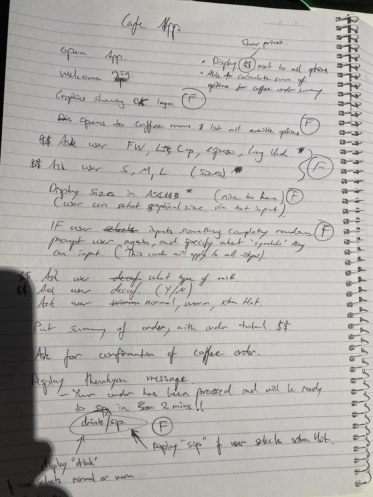

# DK's Coffee Ordering App! ☕️

## Software Development Plan

### Statement of Purpose and Scope

This app will be intended to be used as a way to order take-away coffee in advanced, providing a level of convenience thatll benefit both all shareholders (Cafe owner, and customers). Users will be able to select from a range of coffee's and sizes, with the options to add on extras. 

### Description of App

The app will open up to a welcome page and display DK COFFEE to the user (Displaying name will be for marketing purposes). It will then open up to the selection menu. From the choices availble, the user will then proceed to select the type of coffee and all of its options, such as, sugar, soy or almond milk, milk temperature, etc at the users discretion. An error message will be displayed throughout the whole app if or when the user inputs a random entry, and the user will then be kindly prompted to try again. ASCII images will be used to display the different coffee sizes available, to help with the UX side of things. The app will have a simple "true/false" approach for the user to make its selectionfor the purpose of an easier UI. Pricing will be factored into each ordering phase and the total displayed at the end. If the user is happy with its final order, the app will display an order summary (pricing, coffee type, etc), and then display a "thankyou"message before exiting the program.

### What Problem it will Solve and Why

Many people, especially coffee lovers, are busy proffesionals with tight schedules. This app will hopefully bridge that gap of having to wait in line for their coffee fix, instead, providing them with the luxury of a "coffee-on-the-go" service, so they may go about their day without being inconvenienced. The client, DK's Café, will benfefit from reduced staffing costs and an increase in coffee sales due to the convenience itll provide its existing and potential customers. A win-win for everyone, so why not?

### Who are the Target Audience

The target audience for this app will first and foremost be the "regulars" that come into the clients - DK's Café - shop. We will then use the app to reach out to  the untapped foot traffic of new customers, such as people from surrounding office builidings and general populous. Basically we want all the busy proffesionals in the surrounding area to use our app, in order to boost sales for our client. 

### How will Target Audience use App

People can use this app by downloading it their mobile device, from either the App Store or Google Play, or by scanning the QR code, which will be promoted all theroughout the café. From there, actual use of the app will be very straightforward, with the aim being, no instructions will be requried to use the app. the ordering experience will follow the same logical process as if in person. This will be where the UX/UI of the app will shine!

## App Features


list three of your app features and a pragraph descrbing each




### Feature 1 - Menu's for Coffee Selection 

Promptz asking user to input theire selections

This is a feature thatll let users choose what coffee, any sugar, type of milk, how they want their milk temp at etc, error handling so that user inputs only acceptable symbols, display priciing next to each option etc.

welcome messages and thankyou messages

### Feature 2 - Graphical Display of Coffee Size's

A feature, mainly for the puropses of this assignment, however it can also serve its puropose for a more pleasent UX for the user. ASCII will be used to display coffee sizes in their respective order. Small, medium and large. in addition, ASCII will be also be used for the welcoming message when user first opens the app.

### Feature 3 - Order Summary

this feature is definitely a must have. It will display the users selection and then print to the user their final order along with its final price. price will be structured in using methods etc.

### *Nice to Have Features*

- *An ordered list breaking down the individual cost of the user's coffee, which is displayed along with the final order.*
- *Payment options for the user to select from and make payment directly via the app*
- *Saving user data to a file and retrieve for future orders. The app is able to remmeber the users order  for next time.* 
- *An accurate (live) time representation, telling user exactly when their coffee will be ready, calculating this info based on algorithms deciding how many users are present on the app and how many orders are ahead of current user and based on an average time blocks of how long it takes coffeee barista to make certain coffee's.* 

## User Interaction & Experience

### Feature 1

The app beings with a welcome message whcih simply just displays the name of the clients cafe. 

"DK's Coffee" will be displayed immediately upon opening app, after a 1.5 sec pause it will then direct the user to a prompt asking which coffee they'd like. the user will find out how to use this feature based on the assumption theyve ordered a coffee from a cafe prior to using any sort of coffee ordering app. TThis he menu will follow the same systemitc approach, just as if you were ordering a coffe in person. The ordering process will basically be self explanatory, while the menu functions "guide" the user therough their ordering experience until they reach their final order summary, with the users interacting by inputing their selection from the menu. ie. What coffee would you like? 1)Flat-White, 2)Latte, 3)Cappuccino.The user will input either 1,2 or 3to select their coffee.  errors will be handled by first showing the user the only acceptable inputs and if user makes a mistake, an error messge will be displayed like so, "Oops! Looks like you enetered something else. Please enter a selection from the list."

### Feature 2

The user will not need to do anything to use this feature. it will be automatically displayed when using the app. the images will be displayed for the users enjoyment. as long as the user/s are not blind or have any physical impariments thatll obsrtuct theier eyes from veiwing the app directly, then by the very nature of images being images, the user will interact with this feature via their eyeballs. There should be no errors that the app wil handle with this feture. 

### Feature 3

Once the user has selected their coffee and along with all the otional extras, the app will take them to an order summary page, where it will display the order along with its final price. Again, by going off on the aforementioned assumption, the user will not need to learn how to interect with this feature. simply they will just check if the order is correct, making sure that the app has displayed their selections correclty, then the app will ask the user, "Your order is____, and comes to a total cost of $__. Is this correct?". A Yes or No input will be prompted to the user. If the user is happy with thier order, they can proceed to input a Y for yes, and then the app will display a "thankyou" message before exiting the app and insteructuing the user to pick their order up in 5 mins. If user inputs N for No, the app will then go back to the ordering screen to start the order again. 

## Control Flow Diagram

insert flow chart here

## Implementation Plan

Along with the Control Flow Diagram represented above, a Trello board will be utilised throuough the development of the app and assignment procedures. The Trello board, under the heading- T1A2 AtoZ- has been systematiclly updated and describes each process from the concept initalisaton through to the final product. 

**insert trello screenshot and link*


## Testing

|                        Feature                         | descrpiton of expected outcome | result | other issues |
| :----------------------------------------------------: | ------------------------------ | ------ | ------------ |
|                                                        |                                |        |              |
|                                                        |                                |        |              |
| order summary displays<br />correct order and prcicing |                                |        |              |
|                                                        |                                |        |              |
|                                                        |                                |        |              |
|                                                        |                                |        |              |
|                                                        |                                |        |              |

## INSTALLATION

Instructions can also be found in the help.md file or just click here.

#### Minimum System requirements

​	**OS** 							Windows 10 version 14393.351 or higher/ macOS Catalina or higher

​	**Processor**				Intel Pentium 4 or higher

​	**RAM**				 		512mb or higher

​	**Storage Capacity**	At least 5mb available space

### Installation Steps

1. Please first, install Ruby, if not yet installed on your computer. For MacOS, open terminal and enter:

   ```ruby
   sudo apt-get install ruby
   ```

2. If you do not have bundler installed, please run the follwoing code in terminal to install. 

   ```ruby
   gem install bundler
   ```

3. Now all that's left is to clone the file from this repository and run the program!

   ```ruby
   git clone https://github.com/d1koder/T1A2---Cafe_terminal_app.git
   ```

4. To run program, just type the following in your command line.

   ```ruby
   ruby coffee.rb
   ```

   